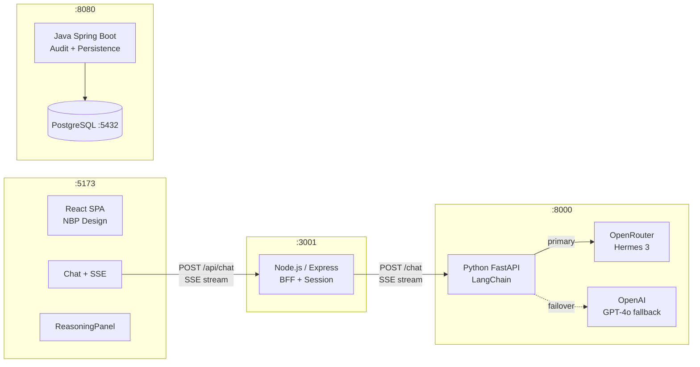

# ADR-000: CodeFixer AI — Architektura Główna

**Data:** 2026-06-30
**Status:** Accepted (zastępuje ADR dla Hardware Service Decision Copilot)
**PRD:** [`docs/PRD-Product-Requirements-Document.md`](../PRD-Product-Requirements-Document.md)

---

## 1. Przegląd

CodeFixer AI to inteligentny asystent debugowania kodu z architekturą poliglotyczną (React / Node.js / Python / Java / PostgreSQL). Użytkownik wkleja kod i błąd, a system agentów przeprowadza wieloetapowe wnioskowanie (Chain-of-Thought Reasoning) i dostarcza poprawkę przez SSE streaming.

---

## 2. Architektura komponentów

```
app/
  frontend/     React 19 + Vite + TypeScript       :5173  (dev)
  gateway/      Node.js 22 + Express               :3001
  agent/        Python 3.12 + FastAPI + LangChain  :8000
  backend/      Java 21 + Spring Boot 3.5          :8080
  docker-compose.yml
```

### Przepływ danych

```
Browser (React :5173)
  → POST /api/chat → Gateway (Node.js :3001)
  → POST /chat    → Agent (Python :8000)
  ← SSE stream    ←────────────────────────
  ← SSE stream    ← Gateway
  ← SSE stream (rendered) ← Browser
```



---

## 3. Stack technologiczny

| Warstwa | Technologia | Uzasadnienie |
|---|---|---|
| **Frontend** | React 19 + TypeScript + Vite | SSE streaming, czyste CSS, NBP design system bez dependencies |
| **Gateway (BFF)** | Node.js 22 + Express + TypeScript | Szybki I/O, natywny SSE proxy, session management |
| **AI Agent** | Python 3.12 + FastAPI + LangChain | Ekosystem AI (LangChain, LangGraph), async streaming |
| **Enterprise Backend** | Java 21 + Spring Boot 3.5 | Audit logs, PostgreSQL persistence, AST parsing (future) |
| **Baza danych** | PostgreSQL 16 | ACID, session history, LLM audit logs |

---

## 4. Środowisko i porty

| Serwis | Port (dev) | Port (Docker) |
|---|---|---|
| React frontend | 5173 | 80 |
| Node.js Gateway | 3001 | 3001 |
| Python Agent | 8000 | 8000 |
| Java Backend | 8080 | 8080 |
| PostgreSQL | 5432 | 5432 |

---

## 5. Zmienne środowiskowe (root `.env`)

| Zmienna | Opis | Wymagana |
|---|---|---|
| `OPENROUTER_API_KEY` | Klucz OpenRouter (Hermes 3) | Tak |
| `OPENAI_API_KEY` | Klucz OpenAI (fallback) | Nie |
| `OPENROUTER_MODEL` | Model główny | Nie (default: hermes-3) |
| `OPENAI_MODEL` | Model fallback | Nie (default: gpt-4o) |
| `POSTGRES_USER` | PostgreSQL user | Nie (default: codefixer) |
| `POSTGRES_PASSWORD` | PostgreSQL password | Tak (prod) |
| `POSTGRES_DB` | PostgreSQL database | Nie (default: codefixer) |

---

## 6. Strategia testowania

| Warstwa | Narzędzia | Zakres |
|---|---|---|
| Unit (Frontend) | Vitest + React Testing Library | Hook logic, SSE parsing, component rendering |
| Unit (Gateway) | Jest + Supertest | Route handlers, session store |
| Unit (Agent) | pytest + httpx | Chain logic, prompt building, failover |
| Unit (Backend) | JUnit 5 + Mockito | Domain models, repository layer |
| Integration | WireMock (Java), pytest fixtures | LLM boundary, SSE stream |
| E2E | Playwright (real stack) | Full chat flow, reasoning panel, failover |

---

## 7. ADR-y szczegółowe

- [`001-backend-api.md`](001-backend-api.md) — Java Spring Boot, nowe modele JPA
- [`002-llm-integration.md`](002-llm-integration.md) — LangChain, OpenRouter, failover
- [`003-frontend.md`](003-frontend.md) — React (migracja z Angular)
- [`004-persistence.md`](004-persistence.md) — PostgreSQL (migracja z H2)
- [`005-gateway.md`](005-gateway.md) — Node.js Express Gateway
